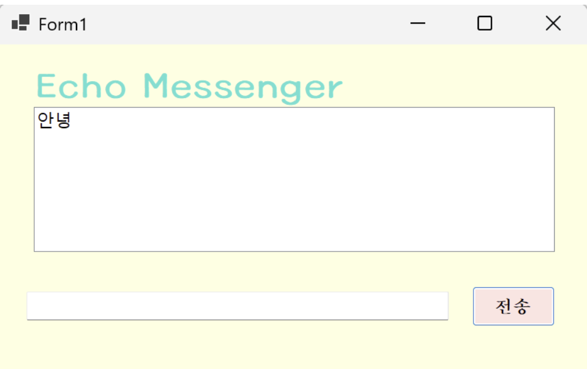
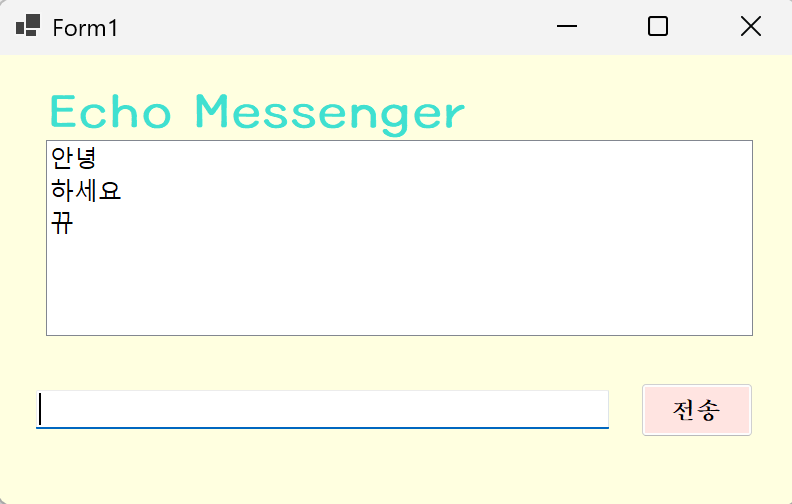
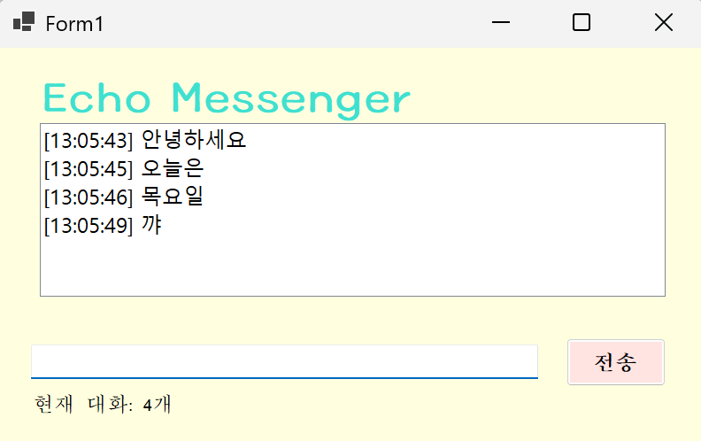

# 3주차 과제: (C# 코딩) Echo Messenger (데이터 입력 처리 및텍스트 문자열(String) 처리방법)
-이름: 하다현 (24018097)

## 개요
- C# 프로그래밍 학습
- 1줄 소개: 사용자로부터 키보드 입력을 받아서 처리하는 프로그램
- 사용한 플랫폼: C#, .NET Windows Forms, Visual Studio, GitHub, Visual Code
- 사용한 컨트롤: Label, TextBox, ListBox, Button
- 사용한 기술과 구현한 기능:
  - Visual Studio를 이용하여 UI 디자인
  - string 클래스를 이용한 사용자 입력 데이터 처리
  - DateTime 클래스를 이용한 현재시간 정보 구하기
  - ListBox의 Items 컬렉션을 이용한 데이터 관리
  - 이벤트 기반 프로그래밍(Click, KeyDown) 구현
  - 사용자 입력 검증 및 예외 처리 기능 구현
  - Trim()을 이용한 문자열 정제 기능 구현

---

## 실행 화면 (과제1)

- 과제 내용
  - Label(표시), TextBox(입력), Button(전송), ListBox(대화창)을 적절히 배치한다.
    cf) Label -> lbTitle
          Button -> btnSend
          ListBox -> lstChat
          TextBox -> txtMessage
  - 전송 버튼 클릭 시 TextBox의 텍스트를 ListBox의 항목(Items)으로 추가한다.
  - 추가 직후 TextBox의 내용을 Clear()메서드를 이용해 비운 후, 다음 입력을 준비한다.

- 구현 내용과 기능 설명
  - 사용자가 입력창(TextBox)에 메시지를 입력하고 전송 버튼을 누르면 메시지를 ListBox에 출력한다.
  - 계속 반복하면 메시지가 리스트 박스에 한 줄씩 계속 추가된다.
  - 추가 내용이 많아지면 리스트박스에 스크롤바가 자동으로 생기고 스크롤돼서 많은 데이터 확인 가능하다. 

-사용한 기술과 구현한 기능:
  - ListBox.Items.Add()를 이용한 데이터 추가
  - TextBox.Clear()를 이용해 입력창(TextBox) 초기화
  - Windows Forms 컨트롤 배치

 ---

## 실행 화면 (과제2)

- 과제 내용
  - 입력창 자동 초기화
  - 포커스 이동
  - Enter 키 전송
  - 공백 입력 방지

- 구현 내용과 기능 설명
    - "전송" 버튼을 클릭하면 입력창이 자동으로 비워짐
    - 커서가 입력창으로 이동하여 연속 입력 가능
    - "전송" 버튼을 누르는 대신, Enter 키를 눌러도 메시지가 전송됨.
        cf) txtMessage_KeyDown() 함수에서 설정하기
    - 공백 입력 시 전송되지 않음
        cf) btnSend_Click() 함수에서 빈 문자열 입력 방지, 입력창에 포커스 갖다 놓기 수행

  - 사용한 기술과 구현한 기능
    - TextBox.Focus()를 이용한 포커스 이동
    - KeyDown 이벤트를 이용한 Enter 입력 처리
    - string.IsNullOrWhiteSpace()를 이용한 공백 검사 

---

## 실행 화면 (과제3)

** 모두 btnSend_Click() 함수에서 작업하면 됨.

- 과제 내용
  - 타임스탬프 추가
  - 메시지 개수 표시
  - 문자열 정제

- 구현 내용과 기능 설명
  - 메시지 앞에 현재 시간을 추가하여 출력
    ** 이때 메시지 중복 출력을 막기 위해 기존 lstChat.Items.Add(typed_msg); 는 주석처리하기** (시간이 포함된 Text만 출력하면 됨)
    - 현재 리스트에 쌓인 개수 계산을 위한 Label 만들기
      lbCount.Text = "현재 대화: " + lstChat.Items.Count + "개"
    - 공백을 제거하여 깔끔한 데이터 저장
      string typed_msg = txtMessage.Text; 맨뒤에 .Trim()만 붙이면 됨. => 사용자가 입력한 메시지의 앞뒤 불필요한 공백을 제거해서 저장

- 사용한 기술과 구현한 기능
  - DateTime.Now를 이용해 Text 뒤에 시간 생성
  - Items.Count를 이용한 개수 계산
  - Trim() 함수를 이용해 문자열 정제

---

## 실행 화면 (과제4)
.png)
.png)

- 과제 내용
  - 선택 항목 삭제
  - 전체 삭제
  - 글자 수 제한

- 구현 내용과 기능 설명
  - ListBox에서 특정 메시지를 마우스로 클릭하고 '삭제' 버튼을 누르면 해당 항목만 목록에서 제거 (**단, 선택하지 않고 삭제 시 발생하는 에러를 예외 처리해야 함.**)(선택 안 했을 때를 -1로 생각하고 예외 처리하는 코드 작성)
  - "전체 삭제" 버튼 만들어 클릭 시 전체 메시지를 한 번에 삭제 가능
  - 50자 초과 입력 시 글자수 제한 문구 표시

- 사용한 기술과 구현한 기능
  - RemoveAt()을 이용한 선택 삭제
  - Clear()를 이용한 전체 삭제
  - Length를 이용한 문자열 길이 제한
  - MessageBox를 이용한 사용자 알림

---

## +) 기능 설명

### 1단계 - 기본 UI 및 데이터 연동
  1. UI구성
    - Label로 "Echo Messenger" 제목 만들기
    - 메시지 전송을 위한 Button 생성
    - 사용자 입력을 위한 TextBox 생성
    - 대화 내용을 출력하는 ListBox 생성

  2. 전송 기능
    - 전송btn 누르면 TextBox의 텍스트를 ListBox 항목으로 추가

  3. 입력창 정리
    - 메시지 전송 후 TextBox()를 Clear()로 비워 다음 입력 준비

### 2단계 - 사용자 편의성(UX) 강화
  1. 입력창 초기화
    - 전송이 끝나면 TextBox에 남겨진 기존 메시지 삭제

  2. 포커스 이동
    - 전송 후, 마우스로 TextBox를 다시 클릭하지 않아도 되도록 커서가 자동으로 위치하도록 설정

  3. Enter 키 전송
    - Button을 마우스 클릭 대신 키보드 Enter 키 로도 메시지 전송 가능하도록 구현

  4. 입력 방어
    - 공백이 입력되면 메시지 전송되지 않도록 처리

### 3단계 - 데이터 가공 및 상태 표시
  1. 타임스탬프 추가
    - 메시지 앞에 현재 시간( [HH:mm:ss] ) 붙여서 ListBox에 출력

     cf) < 날짜 데이터 출력 방법 >
      y: 년 (Year) / yy (26), yyyy (2026)
      M: 월 (Month) / MM (03), MMM (Mar), MMMM (March)
      d: 일 (Day) / dd (18), ddd (수), dddd (수요일)
      H: 시간(24시간) / h: 시간(12시간)
      m: 분 (Minute)
      s: 초 (Second)
      tt: 오전/오후 (AM/PM)

      ex) DateTime now = DateTime.Now;
          Console.WriteLine($"현재 시각: {now:yyyy-MM-dd HH:mm:ss}");

  2. 메시지 개수 표시
    - ListBox의 Items.Count를 이용해 현재 메시지 개수 계산
    - Label을 만들어 "현재 대화: n개"로 출력
        
  3. 문자열 정제
    - 사용자가 입력한 메시지의 앞뒤 불필요한 공백을 Trim() 함수로 제거해 저장
     cf) Trim() 함수 사용 방법: 
      string data = " 20260318 ";
      string clean = data.Trim(); // *공백 제거
      string year = clean.Substring(0, 4); // "2026" // +)특정 부분만 추출

### 4단계 - 데이터 관리 및 심화 기능
  1. 선택 항목 삭제
    - ListBox에서 선택된 항목을 RemoveAt()으로 삭제
  2. 전체 초기화
    - Clear()를 이용하여 ListBox에 있는 전체 메시지 삭제 
  3. 글자 수 제한
    - 메시지 입력을 50자로 제한하고 초과 시 경고 메시지 출력 ("50자 이하로 출력하세요!")
     
---

## 구현 시 어려웠던 점
- 버튼 클릭 시 랜덤 색상을 만드는 코드를 이해하는 것이 조금 어려웠지만, RGB 개념을 공부하며 해결했습니다.
